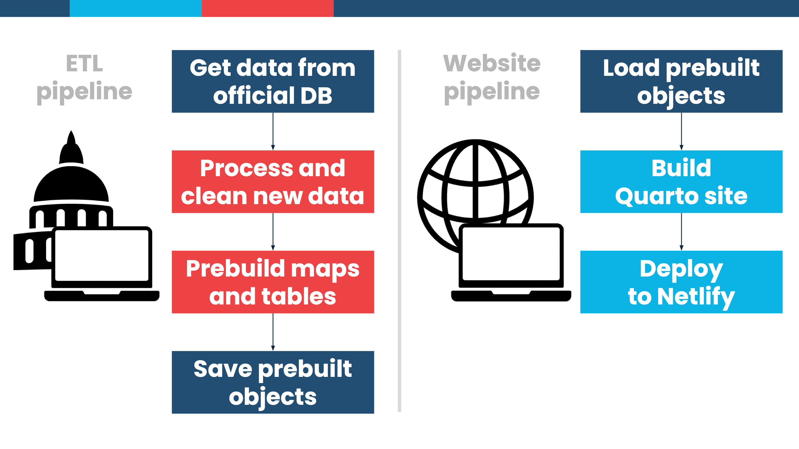

# DIY Election Desk

<!-- README.md is generated from README.qmd. Please edit that file -->

[Gabe Osterhout](https://gabeosterhout.com/) • Data Visualization Specialist, Idaho Secretary of State  
[Andrew Heiss](https://www.andrewheiss.com) • Georgia State University

------------------------------------------------------------------------

Use the [tidyverse](https://www.tidyverse.org/), [{targets}](https://books.ropensci.org/targets/), and [Quarto](https://quarto.org/) to build your own lightning fast, auto-updating election results reporting website!

## Resources

### posit::conf(2025)

- [See our posit::conf(2025) presentation](https://andrewheiss.github.io/election-desk/posit-conf-2025.html)

### Original Idaho sites

- [Primary election](https://archive.voteidaho.gov/results/2024/primary/) (May 2024)
- [General election](https://archive.voteidaho.gov/results/2024/general/) (November 2024)

### Rendered version of this example election

- [DIY Election Desk](https://andrewheiss.github.io/election-desk/)

### Other

- [Guide to generating and rendering computational markdown content programmatically with Quarto](https://www.andrewheiss.com/blog/2024/11/04/render-generated-r-chunks-quarto/)

## Overview

This process has two independent moving parts (complete instructions for running each pipeline included in the projects’ respective READMEs):

1.  The `etl-pipeline` project runs every X minutes and is in charge of **e**xtracting, **t**ransforming, and **l**oading (ETL) the most recent data. With the magic of [{targets}](https://books.ropensci.org/targets/), it will only process remote data that has changed since the last time the pipeline ran. The final outputs (maps, results table, and reporting status) are stored remotely in an S3 bucket (though in this example, outputs are stored locally).

2.  The `website` project runs every Y minutes and uses [{targets}](https://books.ropensci.org/targets/) to pull the latest data from the S3 bucket (or here, local data storage for the ETL pipeline). It then re-builds and deploys the Quarto website if needed.

