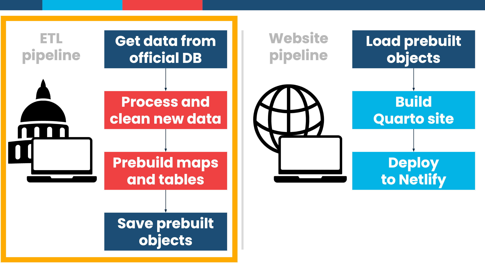

# ETL Pipeline


## Overview



This pipeline is designed to run every X minutes and is in charge of **e**xtracting, **t**ransforming, and **l**oading (ETL) the most recent data. With the magic of [{targets}](https://books.ropensci.org/targets/), it will only process remote data that has changed since the last time the pipeline ran. The final outputs (maps, results table, and reporting status) are stored remotely in an S3 bucket (though in this example, outputs are stored locally).

## How to run

1.  Open the project folder in Positron or open `etl-pipeline.Rproj` in RStudio

2.  Run `renv::restore()` to install all required packages with {renv} (or alternatively run `renv::install()` to bypass specific versions of packages and just install the latest versions)

3.  Run `targets::tar_make()` to run the pipeline

4.  Look at `testing_db.duckdb` to see the example database, or load any of the target objects with `targets::tar_load()`, like `targets::tar_load(presidential_map)`

    - *Bonus*: Explore the database directly in Positron or RStudio with the {connections} package ([see here for more](https://www.andrewheiss.com/blog/2025/07/10/positron-database-connections/))

      ``` r
      options("duckdb.enable_rstudio_connection_pane" = TRUE)

      # Connect to the database
      con <- connections::connection_open(duckdb::duckdb(), "testing_db.duckdb")

      # Explore stuff in the connections pane (Positron) or connections panel (RStudio)

      # Disconnect when all done
      connections::connection_close(con)
      ```
