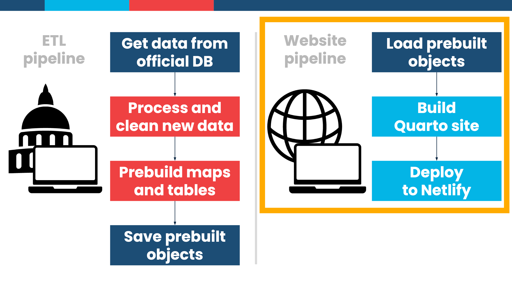

# Website Pipeline

## Overview

This pipeline is designed to run every X minutes uses [{targets}](https://books.ropensci.org/targets/) to pull the latest data from the S3 bucket (or here, local data storage for the ETL pipeline). It then re-builds and deploys the Quarto website if needed

## How to run

0.  Make sure you run the ETL {targets} pipeline first

1.  Open the project folder in Positron or open `election-website.Rproj` in RStudio

2.  Run `renv::restore()` to install all required packages with {renv} (or alternatively run `renv::install()` to bypass specific versions of packages and just install the latest versions)

3.  Run `targets::tar_make()` to run the pipeline

4.  Look at rendered website in `_site/`
